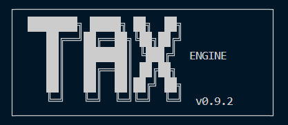

<!-- BACK TO TOP -->
<a id="readme-top"></a>

<!-- PROJECT SHIELDS -->
[![Contributors][contributors-shield]][contributors-url]
[![Forks][forks-shield]][forks-url]
[![Stargazers][stars-shield]][stars-url]
[![Issues][issues-shield]][issues-url]
[![License][license-shield]][license-url]
[![LinkedIn][linkedin-shield]][linkedin-url]

<br />
<div align="center">
  <a href="https://github.com/KeremErkut/TaxEngine">
    
  </a>
  <h3 align="center">TaxEngine</h3>
  <p align="center">
    A command-line tool for calculating Turkish income tax on foreign equity transactions.
    <br />
    <a href="https://github.com/KeremErkut/TaxEngine"><strong>Explore the docs »</strong></a>
    <br />
    <br />
    <a href="https://github.com/KeremErkut/TaxEngine/issues/new?labels=bug">Report Bug</a>
    &middot;
    <a href="https://github.com/KeremErkut/TaxEngine/issues/new?labels=enhancement">Request Feature</a>
  </p>
</div>

---

<!-- TABLE OF CONTENTS -->
<details>
  <summary>Table of Contents</summary>
  <ol>
    <li><a href="#about-the-project">About The Project</a>
      <ul>
        <li><a href="#built-with">Built With</a></li>
      </ul>
    </li>
    <li><a href="#getting-started">Getting Started</a>
      <ul>
        <li><a href="#prerequisites">Prerequisites</a></li>
        <li><a href="#installation">Installation</a></li>
      </ul>
    </li>
    <li><a href="#usage">Usage</a></li>
    <li><a href="#tax-calculation-logic">Tax Calculation Logic</a></li>
    <li><a href="#input-file-format">Input File Format</a></li>
    <li><a href="#project-structure">Project Structure</a></li>
    <li><a href="#running-tests">Running Tests</a></li>
    <li><a href="#contributing">Contributing</a></li>
    <li><a href="#roadmap">Roadmap</a></li>
    <li><a href="#license">License</a></li>
    <li><a href="#contact">Contact</a></li>
    <li><a href="#disclaimer">Disclaimer</a></li>
  </ol>
</details>

---

<!-- ABOUT THE PROJECT -->
## About The Project

TaxEngine is a command-line tool for calculating Turkish income tax liabilities on foreign equity transactions. It implements FIFO lot matching, WPI-based cost indexing, and progressive bracket taxation in full compliance with GVK Mük. Madde 80–81.

Built as a portfolio project to demonstrate production-grade software engineering practices on a non-trivial, regulation-driven domain.

**Key features:**
- FIFO lot matching with partial fill support
- WPI inflation indexing per Turkish tax law (acquisition month inclusive, sale month exclusive)
- Progressive income tax bracket calculation
- Excel and PDF report generation with audit trail
- Fully configuration-driven — no code changes needed for new fiscal years

<p align="right">(<a href="#readme-top">back to top</a>)</p>

### Built With

* [![Python][Python.org]][Python-url]
* [![Pydantic][Pydantic.dev]][Pydantic-url]
* [![openpyxl][openpyxl-badge]][openpyxl-url]
* [![ReportLab][ReportLab-badge]][ReportLab-url]
* [![pytest][pytest-badge]][pytest-url]

<p align="right">(<a href="#readme-top">back to top</a>)</p>

---

<!-- GETTING STARTED -->
## Getting Started

### Prerequisites

- Python 3.9+
- pip

### Installation

1. Clone the repository
   ```bash
   git clone https://github.com/KeremErkut/TaxEngine.git
   cd TaxEngine
   ```
2. Create and activate a virtual environment
   ```bash
   python -m venv .venv
   source .venv/bin/activate       # Windows: .venv\Scripts\activate
   ```
3. Install dependencies
   ```bash
   pip install -r requirements.txt
   pip install -e .
   ```

<p align="right">(<a href="#readme-top">back to top</a>)</p>

---

<!-- USAGE -->
## Usage

```bash
taxengine --trades <path> --format <excel|pdf> [options]
```

**Required arguments**

| Argument | Description |
|----------|-------------|
| `--trades` | Path to trade history file (CSV or Excel) |
| `--format` | Output report format: `excel` or `pdf` |

**Optional arguments**

| Argument | Default | Description |
|----------|---------|-------------|
| `--rates` | `examples/tcmb_rates.csv` | CBRT (TCMB) FX rate file |
| `--wpi` | `examples/tuik_wpi.csv` | TURKSTAT (TÜİK) WPI index file |
| `--config` | `config/tax_config_2025.yaml` | Tax configuration file |
| `--output` | Auto-generated | Output file path |

**Examples**

```bash
taxengine --trades examples/sample_trades.csv --format excel
taxengine --trades examples/sample_trades.csv --format pdf --output my_report.pdf
```

<p align="right">(<a href="#readme-top">back to top</a>)</p>

---

<!-- TAX CALCULATION LOGIC -->
## Tax Calculation Logic

**FIFO lot matching:** Buy lots are consumed in chronological order. Partial fills are supported across multiple lots.

**WPI indexing (GVK Mük. 81):** If the WPI ratio between the purchase month (inclusive) and the month preceding the sale (exclusive) exceeds 10%, the cost basis is inflation-adjusted before gain calculation.

**Progressive taxation:** Net gains are taxed against the fiscal year brackets defined in `tax_config_2025.yaml`. All net gains are fully taxable — there is no exemption or declaration threshold for foreign equity capital gains.

**Decimal precision:** All monetary calculations use Python `Decimal` throughout. No floating-point arithmetic is performed at any stage.

<p align="right">(<a href="#readme-top">back to top</a>)</p>

---

<!-- INPUT FILE FORMAT -->
## Input File Format

Trade history CSV must contain the following columns:

| Column | Type | Example |
|--------|------|---------|
| `trade_date` | YYYY-MM-DD | `2024-03-15` |
| `ticker` | String | `AAPL` |
| `trade_type` | BUY / SELL | `BUY` |
| `quantity` | Decimal | `10` |
| `price_fc` | Decimal | `150.50` |
| `currency` | String | `USD` |

> The CSV files in `examples/` are mock datasets for testing purposes only. They do not represent official CBRT (TCMB) or TURKSTAT (TÜİK) data and must not be used for real-world tax filings.

<p align="right">(<a href="#readme-top">back to top</a>)</p>

---

<!-- PROJECT STRUCTURE -->
## Project Structure

```
TaxEngine/
├── config/
│   └── tax_config_2025.yaml       # Tax brackets and WPI threshold
├── examples/
│   ├── sample_trades.csv          # Mock trade history (test only)
│   ├── tcmb_rates.csv             # Mock CBRT FX rates (test only)
│   └── tuik_wpi.csv               # Mock TURKSTAT WPI indices (test only)
├── src/
│   ├── main.py                    # CLI entry point
│   ├── config_loader.py           # Decimal-safe YAML loader
│   ├── models/                    # Pydantic data models
│   ├── loader/                    # Data ingestion layer
│   ├── engine/                    # Business logic (FIFO, WPI, tax)
│   └── reporter/                  # Excel and PDF report generation
└── tests/
    ├── conftest.py
    └── engine/
        ├── test_fifo_engine.py
        └── test_tax_calculator.py
```

<p align="right">(<a href="#readme-top">back to top</a>)</p>

---

<!-- RUNNING TESTS -->
## Running Tests

```bash
pytest tests/ -v
```

<p align="right">(<a href="#readme-top">back to top</a>)</p>

---

<!-- CONTRIBUTING -->
## Contributing

Contributions are welcome. If you have a suggestion or find a bug, please open an issue with the appropriate label.

If you'd like to contribute code:

1. Fork the project
2. Create your feature branch (`git checkout -b feature/your-feature`)
3. Commit your changes (`git commit -m 'feat: add your feature'`)
4. Push to the branch (`git push origin feature/your-feature`)
5. Open a Pull Request

### Top Contributors

<a href="https://github.com/KeremErkut/TaxEngine/graphs/contributors">
  
</a>

<p align="right">(<a href="#readme-top">back to top</a>)</p>

---

<!-- ROADMAP -->
## Roadmap

- [x] FIFO engine with WPI indexing
- [x] Progressive bracket tax calculation
- [x] Excel and PDF report generation
- [x] CLI entry point
- [x] Unit test suite
- [ ] Multi-currency support
- [ ] Automated data fetching — TCMB FX rates, TÜİK WPI indices, and trade history via API (replacing manual CSV input)
- [ ] REST API — expose the calculation engine as a standalone HTTP service (FastAPI), enabling TaxEngine to be called by external systems
- [ ] Web UI

See the [project tab](https://github.com/users/KeremErkut/projects/2) for a full list of proposed features and known issues in.

<p align="right">(<a href="#readme-top">back to top</a>)</p>

---

<!-- LICENSE -->
## License

Distributed under the Apache 2.0 License. See [`LICENSE`](https://github.com/KeremErkut/TaxEngine/blob/main/LICENSE) for more information.

<p align="right">(<a href="#readme-top">back to top</a>)</p>

---

<!-- CONTACT -->
## Contact

Kerem Erkut Çiftlikçi — [LinkedIn](https://www.linkedin.com/in/kerem-erkut-%C3%A7iftlik%C3%A7i-150345329/)

Project Link: [https://github.com/KeremErkut/TaxEngine](https://github.com/KeremErkut/TaxEngine)

<p align="right">(<a href="#readme-top">back to top</a>)</p>

---

<!-- DISCLAIMER -->
## Disclaimer

This tool is for informational purposes only and does not constitute official tax advice. Consult a certified tax professional (mali müşavir) before filing your tax declaration.

<p align="right">(<a href="#readme-top">back to top</a>)</p>

---

<!-- MARKDOWN LINKS & IMAGES -->
[contributors-shield]: https://img.shields.io/github/contributors/KeremErkut/TaxEngine.svg?style=for-the-badge
[contributors-url]: https://github.com/KeremErkut/TaxEngine/graphs/contributors
[forks-shield]: https://img.shields.io/github/forks/KeremErkut/TaxEngine.svg?style=for-the-badge
[forks-url]: https://github.com/KeremErkut/TaxEngine/network/members
[stars-shield]: https://img.shields.io/github/stars/KeremErkut/TaxEngine.svg?style=for-the-badge
[stars-url]: https://github.com/KeremErkut/TaxEngine/stargazers
[issues-shield]: https://img.shields.io/github/issues/KeremErkut/TaxEngine.svg?style=for-the-badge
[issues-url]: https://github.com/KeremErkut/TaxEngine/issues
[license-shield]: https://img.shields.io/github/license/KeremErkut/TaxEngine.svg?style=for-the-badge
[license-url]: https://github.com/KeremErkut/TaxEngine/blob/main/LICENSE
[linkedin-shield]: https://img.shields.io/badge/-LinkedIn-black.svg?style=for-the-badge&logo=linkedin&colorB=555
[linkedin-url]: https://www.linkedin.com/in/kerem-erkut-%C3%A7iftlik%C3%A7i-150345329/

[Python.org]: https://img.shields.io/badge/Python-3776AB?style=for-the-badge&logo=python&logoColor=white
[Python-url]: https://www.python.org/
[Pydantic.dev]: https://img.shields.io/badge/Pydantic-E92063?style=for-the-badge&logo=pydantic&logoColor=white
[Pydantic-url]: https://docs.pydantic.dev/
[openpyxl-badge]: https://img.shields.io/badge/openpyxl-217346?style=for-the-badge&logo=microsoftexcel&logoColor=white
[openpyxl-url]: https://openpyxl.readthedocs.io/
[ReportLab-badge]: https://img.shields.io/badge/ReportLab-003366?style=for-the-badge&logoColor=white
[ReportLab-url]: https://www.reportlab.com/
[pytest-badge]: https://img.shields.io/badge/pytest-0A9EDC?style=for-the-badge&logo=pytest&logoColor=white
[pytest-url]: https://docs.pytest.org/
